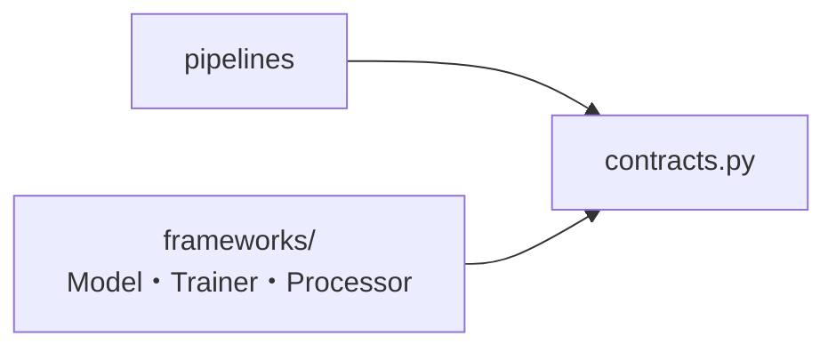

# TorchMine

**モデル構造、学習方法、前処理・後処理を独立した部品として組み合わせ、ニューラルネットワークの実験を構築するPyTorchベースのフレームワーク**

TorchMineでは、Model・Trainer・Processor・Pipelineを共通の契約に沿って実装します。実験ごとに学習スクリプト全体を書き直す代わりに、変更したい部品を差し替えることで、異なるモデル構造や学習条件を同じ流れで実行・比較できます。



## TorchMineでできること

TorchMineは、ニューラルネットワークの実験を構成する要素を、交換可能な部品として扱います。

- モデル構造、学習方法、前処理・後処理を個別に実装し、組み合わせて実験できる
- 設定を変更するだけで部品を差し替え、同じPipeline上で比較できる
- 実験に使用した構成と学習済みパラメータを保存し、後から同じ推論処理を再構築できる
- プロジェクト固有のModel・Trainer・Processor・Pipelineを追加し、TorchMineの構成要素として利用できる

データの読み込み、データセットの分割、評価指標は、実験の目的に応じて利用プロジェクト側で定義します。これにより、TorchMineはモデルの学習と推論に責務を絞り、異なるデータセットや評価方法にも同じ構成を適用できます。

## テスト実行
例として、MNIST を使った手書き数字の分類問題を畳み込みNNを用いて学習させます。

※ テストスクリプトの実行には **`mise` のインストールが必要**です。初回は MNIST データがダウンロードされます。

```bash
mise install
uv sync --locked --group mnist
uv run python scripts.mnist_train
```

学習終了時に表示される `checkpoint:` のパスを、次のコマンドに渡します。

```bash
uv run python scripts.mnist_predict <checkpointのパス>
```

学習結果は `data/train_.../` に保存されます。推論ではテストデータ5枚を予測し、同ディレクトリに学習時の損失推移と分類結果を出力します。設定や前処理の具体例は [scripts/mnist_train.py](scripts/mnist_train.py) を参照してください。

## 別プロジェクトでの使用方法

別プロジェクトでTorchMineを利用する場合は、利用側のプロジェクトでTorchMineのパスを指定します。

```bash
uv add --editable ../TorchMine
```

その後は Python パッケージとして読み込めます。

```python
import TorchMine
```

独自の部品を追加する手順は [拡張ガイド](docs/extending.md) にまとめています。

## 実装例

以下の Model・Trainer・Processor・Pipeline は動作例です。

| 種類 | 設定名 | 実装 |
| --- | --- | --- |
| Model | `conv2d_classifier` | [Conv2DClassifier](src/torchmine/frameworks/models/conv2d_classifier.py) |
| Trainer | `mse` | [MSETrainer](src/torchmine/frameworks/trainers/mse_trainer.py) |
| Processor | `normalizer` | [NormalizerProcessor](src/torchmine/frameworks/processors/normalizer.py) |
| Processor | `identity` | [IdentityProcessor](src/torchmine/frameworks/processors/identity.py) |
| Pipeline | `workflow_early_stopping` | [WorkflowEarlyStoppingPipeline](src/torchmine/pipelines/workflow_early_stopping.py) |

## ドキュメント

- [設計と責務](docs/architecture.md): 契約、依存関係、学習・推論の流れ
- [拡張ガイド](docs/extending.md): Model・Trainer・Processor の追加方法
- [Pipeline 実装例](docs/pipeline.md): 設定、Processor の順序、結果と checkpoint
