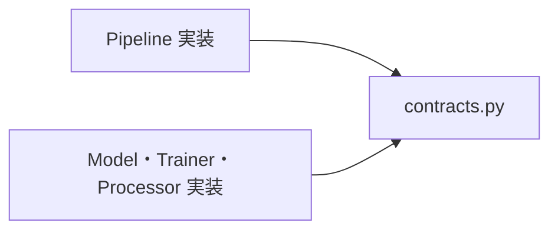
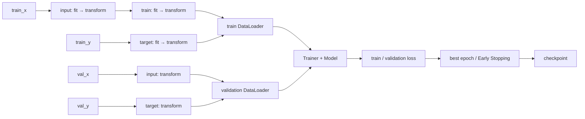

# 設計と責務

TorchMine では [contracts.py](../src/torchmine/contracts.py) の抽象基底クラスが設計の中心です。`pipelines/` と `frameworks/` の実装は、それぞれ対応するクラスを継承します。

## 部品の責務
部品は以下の粒度で作成します
- Model: ニューラルネットワークの構造
- Trainer: 学習方法（MSEなど）
- Processor: 学習の前処理・後処理
- Pipeline: 全体の学習の流れ

| 部品 | Contract | 責務 |
| --- | --- | --- |
| Model | `ModelBase` | `forward(x)` で入力 Tensor から予測 Tensor を返す。 |
| Trainer | `TrainerBase` | `train_epoch(loader)` で更新し、`evaluate(loader)` で評価損失を返す。 |
| Processor | `ProcessorBase` | `transform(data)` で Tensor を変換する。必要に応じて統計量と状態を管理する。 |
| Pipeline | `PipelineBase` | `train_data(data)` と `predict_data(data)` を利用側に提供する。 |

部品を追加する場合は、表の抽象基底クラスを必ず継承します。Pipeline と frameworks の双方が contracts に依存し、互いの具体的な実装には依存させないようにします。

## 学習フローの例

`WorkflowEarlyStoppingPipeline` は入力とターゲットの Processor を学習データから統計量を計算し、その結果で検証データを変換します。学習用 Processor は学習データだけに適用します。

## 推論フローの例

checkpoint の読み込みでは Model と各 Processor の状態を復元します。推論時には学習用 Processor を使いません。ターゲットの逆変換は設定の逆順で実行します。

この Pipeline 実装例にテストデータの評価機能などはありません。比較用の指標やテストデータの扱いは、利用プロジェクトで統一できます。

設定項目と Processor の適用順序は [Pipeline ガイド](pipeline.md) を参照してください。
