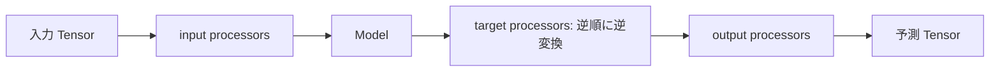

# Pipeline 実装例

この文書は、同梱の [WorkflowEarlyStoppingPipeline](../src/torchmine/pipelines/workflow_early_stopping.py) を例に使い方を説明します。

## 呼び出し例

以下は `train_x` / `val_x` が `[N, 1, H, W]` の画像 Tensor、`train_y` / `val_y` が `[N, 10]` の one-hot Tensor として用意されている場合の例です。細かい仕様は実際に [MNIST 学習スクリプト](../scripts/mnist_train.py) を参照してください。

```python
from pathlib import Path

from torchmine.pipelines import (
    ProcessorConfig,
    WorkflowConfig,
    WorkflowEarlyStoppingPipeline,
    WorkflowTrainingData,
)

config = WorkflowConfig(
    model_name="conv2d_classifier",
    trainer_name="mse",
    model_params={"in_channels": 1, "num_classes": 10},
    input_processors=[ProcessorConfig("normalizer", {"dims": [0, 2, 3]})],
    out_dir=Path("data"),
)
pipeline = WorkflowEarlyStoppingPipeline(config)
result = pipeline.train_data(WorkflowTrainingData(
    train_x=train_x,
    train_y=train_y,
    val_x=val_x,
    val_y=val_y,
))
predictions = pipeline.predict_data(val_x)
print(result.checkpoint_path, predictions.shape)
```

予測は `torch.Tensor` を返します。分類クラスなどへの変換と評価指標の計算などは利用側で行います。

## Processor の役割

各リストの Processor は記載した順に `transform()` されます。`fit()` は学習データだけで呼ばれます。

| 設定 | 学習データ | 検証データ | 推論データ |
| --- | --- | --- | --- |
| `input_processors` | `fit` → `transform` | `transform` | `transform` |
| `train_processors` | `fit` → `transform` | 適用しない | 適用しない |
| `target_processors` | `fit` → `transform` | `transform` | 逆順に `inverse_transform` |
| `output_processors` | 適用しない | 適用しない | `transform` |

`train_processors` は訓練画像の拡張などに使用します。変換は DataLoader 作成前に一度だけ行われ、各 epoch で再実行されません。`output_processors` は統計量などの保存が必要ないため、そのまま使用できる Processor を指定します。不要な役割のリストは空にします。



## 主な設定

| 項目 | 内容 |
| --- | --- |
| `model_name`, `trainer_name` | Registry に登録した部品名。 |
| `model_params`, `trainer_params` | 各部品のコンストラクタ引数。 |
| `epochs`, `batch_size`, `lr`, `eps` | 学習回数、バッチサイズ、Adam optimizer の設定。 |
| `seed`, `shuffle`, `num_workers`, `device` | 学習の乱数、DataLoader、実行デバイスの設定。 |
| `early_stopping`, `patience`, `min_delta` | validation loss による停止条件。 |
| `restore_best`, `save_best`, `save_last` | 最良状態の復元、best / last checkpoint の保存。 |
| `out_dir`, `output` | 実行ディレクトリの親と checkpoint のファイル名。 |

`device=None` では CUDA が利用できれば CUDA、そうでなければ CPU を選びます。`output=Path("mnist.pt")` の場合、checkpoint 名は `mnist_best.pt` と `mnist_last.pt` になります。

## 結果・保存・読み込み

各 epoch で train / validation loss を表示し、`WorkflowResults` に `train_loss_history`、`val_loss_history`、`best_epoch`、`stopped_epoch`、`run_dir`、各 checkpoint のパスを返します。`out_dir/train_.../config.yaml` に使用した設定が保存されます。

best checkpoint は validation loss が更新された時点の状態です。last checkpoint は学習終了時の状態で、`restore_best=True` の場合は復元後の Model を保存します。`checkpoint_path` は best があれば best、なければ last を指します。両方の保存を無効にした場合は `None` です。

checkpoint には設定、Model と Processor の状態、epoch と 学習損失履歴が含まれます。`WorkflowTrainingData.checkpoint_payload` で追加情報を保存できますが、既存の checkpoint キーは上書きできません。optimizer の状態や元データ・分割は保存しません。

```python
from torchmine.pipelines import WorkflowEarlyStoppingPipeline

loaded = WorkflowEarlyStoppingPipeline().load_model(
    result.checkpoint_path,
    device="cpu",
)
predictions = loaded.predict_data(val_x)
```
